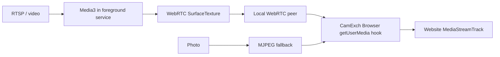

# CamExch

CamExch is an Android MVP made of two apps:

- **CamExch Source** chooses a virtual camera source: RTSP URL, video file, or photo file.
- **CamExch Browser** is a small WebView browser with tabs. It leaves the rear camera untouched and replaces front-camera `getUserMedia()` requests with the Source app frame stream.

The project is designed to build on GitHub Actions, so no Android Studio, Gradle, or Git installation is required on the local computer.

## Current MVP Flow

1. Install `source-debug.apk` and `browser-debug.apk` from the GitHub Actions artifact.
2. Open **CamExch Source**.
3. Select `RTSP`, `Video`, or `Photo`.
4. For RTSP, enter a local stream address such as:

   ```text
   rtsp://192.168.4.132/live
   ```

5. Tap `Start`.
6. Open **CamExch Browser**.
7. Visit a camera test site, for example:

   ```text
   https://webcamtests.com/
   ```

8. Choose the virtual/front camera. The browser injects a `CamExch Virtual Front Camera` device and receives RTSP/video through a local WebRTC connection. Photos use the local MJPEG fallback.

The `!` button near the address bar shows `virtual camera source active`.

## Architecture



The browser installs its camera hook at document start, before site scripts can capture the original `getUserMedia()` function. RTSP and video frames remain on the hardware-accelerated Surface/WebRTC path and are not converted to JPEG. Playback belongs to the foreground service, so switching from Source to Browser does not destroy the decoder surface. The selected source is restored if Android restarts the service.

## Browser Features

- Address bar.
- Back and forward buttons.
- Reload button.
- Multiple tabs.
- Long-press a tab to close it.
- Automatic front-camera override for `video: true`, `facingMode: "user"`, an unconstrained default camera request, or `deviceId: "camexch-virtual-front"`.
- A physical camera selected by `deviceId` is inspected through `MediaStreamTrack.getSettings()` and replaced automatically when it reports `facingMode: "user"`.
- Rear camera requests are passed through to the real Android camera.

## Build

The repository includes `.github/workflows/android.yml`.

Manual local build, if Gradle is available:

```bash
gradle assembleDebug
```

APK outputs:

```text
source/build/outputs/apk/debug/source-debug.apk
browser/build/outputs/apk/debug/browser-debug.apk
```

## Notes

This is a testing/browser-controlled virtual camera. Android does not expose a normal public API that lets an ordinary app register a system-wide camera device for Chrome, Brave, Firefox, or arbitrary native apps without root/system privileges.
