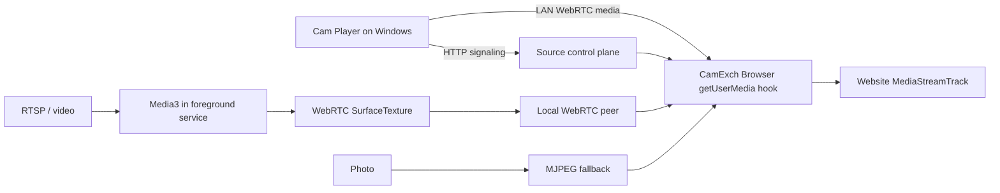

# CamExch

CamExch is a camera-routing suite made of two Android apps and one portable Windows app:

- **CamExch Source** chooses the `Front Camera 4` source: RTSP URL, video file, or photo file.
- **CamExch Browser** is a small WebView browser with tabs and explicit `F`, `R`, and `N` camera routes.
- **Cam Player** is a portable Windows photo/video player that sends its composed output directly to Browser over LAN WebRTC. Source handles discovery, connection ownership, constraints, and signaling; it does not decode or re-encode Cam Player video.

The project is designed to build on GitHub Actions, so no Android Studio, Gradle, or Git installation is required on the local computer.

## Cam Player Flow

1. Download and run `Cam-Player-*-Windows-x64.exe`.
2. Open a photo or video. Video starts paused on its first frame.
3. Enter any even output width and height supported by the GPU.
4. Use the mouse wheel to scale the source and drag to position it.
5. Hold Space while scrolling or dragging to inspect the preview without changing output.
6. In Source, select `Cam Player`. Source discovers Cam Player automatically and prefers an available USB route. Use the address field and `Connect` only as a manual fallback.
7. Tap `Start` in Source.
8. Select `F` in Browser before the website requests the camera.

`Follow site and phone orientation` makes Cam Player apply the site's requested dimensions in the phone's physical orientation. For example, a `2000x1500` camera request produces `1500x2000` while the phone is portrait and changes live to `2000x1500` after a landscape rotation. The WebRTC track remains active and the page is not reloaded.

For USB tethering, connect the phone and enable USB tethering. Source locks the exact address selected at Start for the complete session. USB never changes to Wi-Fi and Wi-Fi never changes to USB automatically; after a route failure, stop and start Source explicitly. Cam Player and Browser logs report the selected ICE candidate pair so the actual route can be verified.

Cam Player accepts photos and Chromium-compatible video directly. MKV and AVI files are remuxed to MP4 with bundled FFmpeg; incompatible codecs use a compatibility H.264/AAC transcode. No separate runtime is required.

## Current MVP Flow

1. Install `source-debug.apk` and `browser-debug.apk` from the GitHub Actions artifact.
2. Open **CamExch Source**.
3. Select `RTSP`, `Video`, or `Photo`.
4. For RTSP, enter a local stream address such as:

   ```text
   rtsp://192.168.4.132/live
   ```

5. Tap `Start`.
6. Open **CamExch Browser**.
7. Visit a camera test site, for example:

   ```text
   https://webcamtests.com/
   ```

8. Choose `Front Camera 4`. The browser receives RTSP/video through a local WebRTC connection. Photos use the local image bridge.

The `!` button near the address bar shows `Front Camera 4 source active`. Long-press it to open the Browser log and copy it to the clipboard. Source has a `Logs` button with the same copy action. After a crash, either app opens its saved crash log before retrying normal startup.

The floating camera controls provide three routes: `F` forces Source, `R` forces the managed
rear-camera route, and `N` passes the site's constraints and native `MediaStream` through
Android WebView without a CamExch frame proxy. Browser diagnostics aggregate rendered-frame,
WebRTC, and Canvas readback metrics every five seconds. Source logs direct H.264 input,
output, and drop counters every two seconds while RTSP is active.

Source starts its native WebRTC pipeline only for RTSP and video after `Start` is tapped. Photo mode does not load WebRTC. Native initialization and playback failures are reported in the Source screen instead of closing the app.

WebRTC frame ownership remains with `SurfaceTextureHelper`; the capture listener forwards frames without releasing them a second time. Source and Browser exchange mode, SDP, and photo data through a signature-protected Android `ContentProvider`, avoiding WebView mixed-content and Private Network Access restrictions. If Source is unavailable, Browser falls back to the phone camera.

## Architecture


```mermaid
flowchart LR
    A["RTSP / video"] --> B["Media3 in foreground service"]
    B --> C["WebRTC SurfaceTexture"]
    C --> D["Local WebRTC peer"]
    E["Photo"] --> F["MJPEG fallback"]
    I["Cam Player on Windows"] -->|"LAN WebRTC media"| G
    I -->|"HTTP signaling"| J["Source control plane"]
    J --> G
    D --> G["CamExch Browser getUserMedia hook"]
    F --> G
    G --> H["Website MediaStreamTrack"]
```

The browser installs its camera hook at document start, before site scripts can capture the original `getUserMedia()` function. H.264 RTSP access units pass directly into WebRTC without decoding or re-encoding. Other RTSP codecs automatically use the decoded Surface/WebRTC fallback. Video-file frames remain on the hardware-accelerated Surface/WebRTC path and are not converted to JPEG. Playback belongs to the foreground service, so switching from Source to Browser does not destroy the media pipeline. The selected source is restored if Android restarts the service.

Cam Player renders its arbitrary-resolution output with WebGL. Its background is a bounded, strongly blurred cache of the first media frame, so a large photo is not duplicated at full resolution and playback does not render a second moving video. One deadline-based pacer owns all generated frames for playback, pause/photo heartbeat, Motion, interaction, and bootstrap. Decoded callbacks and controls only replace the latest composition; missed deadlines are skipped instead of replayed as bursts. The pacer writes timestamped WebCodecs frames to one `MediaStreamTrackGenerator`, and writable backpressure retains at most one latest pending frame. The sender uses the actually interoperable H.264 codec, keeps the selected resolution, applies stable motion/detail profiles, and limits keyframe fallback to material output changes.

Browser, Source, and Cam Player use asynchronous signaling with session/request IDs. Browser retains a healthy source session through short site probe/reopen cycles and applies changed geometry to that session before returning the next track. A newer pending offer cancels unfinished negotiation, and Cam Player keeps one active encoder. Explicit `Start` gives one Source installation ownership of Cam Player; a newer phone displaces a stale owner. Source stops discovery after Start and locks the selected route until Stop. Managed rear-camera switching transfers native `VideoFrame` objects through `MediaStreamTrackProcessor/Generator`; the Canvas path is only a compatibility fallback. Media flows directly from Windows to Browser, avoiding an Android decode/encode hop.

## Browser Features

- Address bar.
- Back and forward buttons.
- Reload button.
- Multiple tabs with a visible close button. Closing the last tab opens Google.
- `F` is the default route and sends Source while retaining the requested front/back camera identity.
- A physical camera selected by `deviceId` is inspected through `MediaStreamTrack.getSettings()` and replaced automatically when it reports `facingMode: "user"`.
- Rear camera requests are passed through to the real Android camera.
- Explicit microphone diagnostics record whether audio was requested and which audio tracks were returned. Audio routing itself is unchanged.

## Build

The repository includes `.github/workflows/android.yml`.

Manual local build, if Gradle is available:

```bash
gradle assembleDebug
```

APK outputs:

```text
source/build/outputs/apk/debug/source-debug.apk
browser/build/outputs/apk/debug/browser-debug.apk
```

Cam Player local build, when Node.js and pnpm are available:

```bash
cd cam-player
pnpm install
pnpm test
pnpm test:electron
pnpm dist
```

Windows output:

```text
cam-player/dist/Cam-Player-*-Windows-x64.exe
```

## Notes

This is a browser-controlled test camera source. Android does not expose a normal public API that lets an ordinary app register a system-wide camera device for Chrome, Brave, Firefox, or arbitrary native apps without root/system privileges.
